## Refloat 

[](https://pkg.go.dev/github.com/sugawarayuuta/refloat)

Float parser that sacrifices nothing.


### Features

- Accurate. It finds the "best" approximation to the input just like the standard library, strconv. Fuzzing tests in addition to standard library tests and [parse-number-fxx-test-data](https://github.com/nigeltao/parse-number-fxx-test-data) are actively done.

- Compatible. Basically, it is an improvement on `ParseFloat` in the standard library, and the usage is exactly the same.

- Fast. Faster than the standard library on benchmarks with normally distributed floats and bitwise uniform random float inputs. For more information, benchmark it yourself or see below.

### Installation

```
go get github.com/sugawarayuuta/refloat
```

### Benchmarks

```mermaid
gantt
title norm = normally distributed, bits = bitwise uniform (ns/op - lower is better)
todayMarker off
dateFormat  X
axisFormat %s
section bits 64bit 
strconv: 0,106
refloat: 0,91
section norm 64bit 
strconv: 0,92
refloat: 0,65
section bits 32bit 
strconv: 0,79
refloat: 0,80
section norm 32bit 
strconv: 0,65
refloat: 0,49
```



### Articles

There are articles written in [English](https://refloat.dev/) and [Japanese](https://zenn.dev/sugawarayuuta/articles/a1e02476fd34d5).

### Thank you

The icon above is from [gopher-stickers](https://github.com/tenntenn/gopher-stickers) by Ueda Takuya.

[Awesome talk](https://youtu.be/AVXgvlMeIm4?si=kUmg4fyINKRQLYEu) and [inspirational algorithm](https://github.com/lemire/fast_double_parser) by Daniel Lemire.

[Sollya is used](https://sollya.org/) for precomputing the polynomial for approximations.